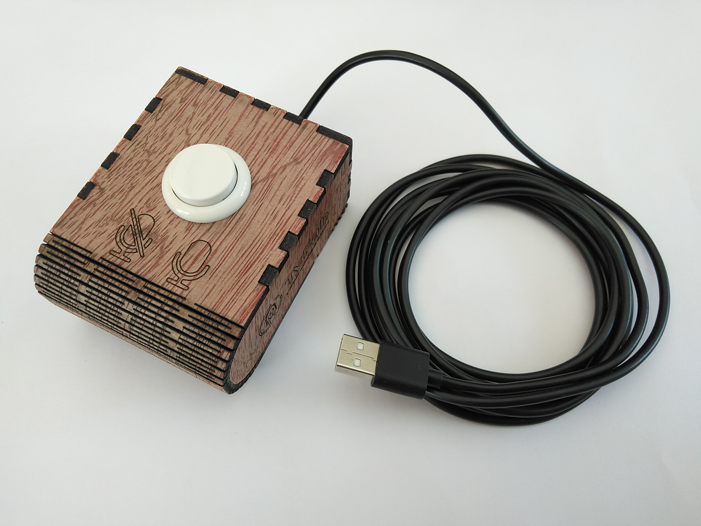
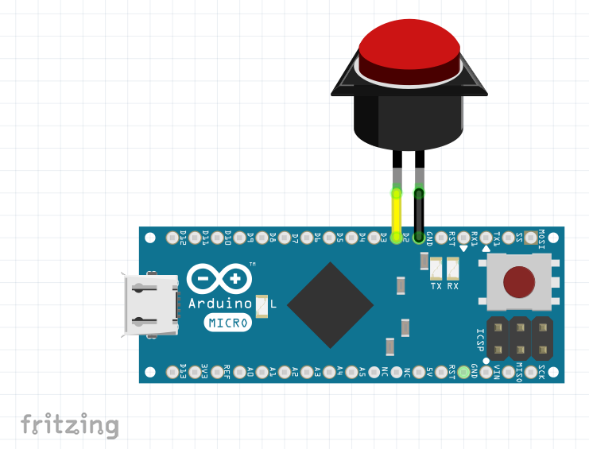
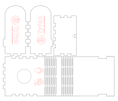

[:fr:](LISEZMOI.md) [:uk:](README.md)

# OneButton
Clavier à un bouton

### Liste du matériel
- Arduino pro micro, ou Arduino micro (ex: https://www.amazon.fr/KeeYees-ATmega32U4-Développement-Leonardo-Bootloader/dp/B07FQJW2KN)
- Bouton d'Arcade Diam 24mm (ex: https://www.amazon.fr/dp/B0819ZZRKC )
- Planche de contreplaqué 3mm dimension 20x20mm

### Schéma

### Code Arduino

[OneButton.ino](OneButton.ino?raw=true)

    #include "Keyboard.h"
    //https://www.arduino.cc/reference/en/language/functions/usb/keyboard/
    
    // use this option for OSX.
    // Comment it out if using Windows or Linux:
    // char ctrlKey = KEY_LEFT_GUI;
    // use this option for Windows and Linux.
    // leave commented out if using OSX:
    char ctrlKey = KEY_LEFT_CTRL;
    char altKey = KEY_LEFT_ALT;
    char altgrKey = KEY_RIGHT_ALT;
    char shiftKey = KEY_LEFT_SHIFT;
    char winKey = KEY_LEFT_GUI;
    
    void setup() {
      // make pin 2 an input and turn on the pull-up resistor so it goes high unless
      // connected to ground:
      pinMode(2, INPUT_PULLUP);
      // initialize control over the keyboard:
      Keyboard.begin();
    }
    
    void loop() {
      while (digitalRead(2) == HIGH) {
        // do nothing until pin 2 goes low
        delay(20);
      }
      
      //send alt+a (azerty keyboard) default shortcut for Zoom
      Keyboard.press(altKey);
      Keyboard.press('q'); //send scancode of 'a' key (azerty)
      delay(100);
      Keyboard.releaseAll();
    
      while (digitalRead(2) == LOW) {
        // do nothing until pin 2 goes high
        delay(20);
      }
    }
    
### Boitier

[OneButtonBox.svg](img/OneButtonBox.svg?raw=true)

