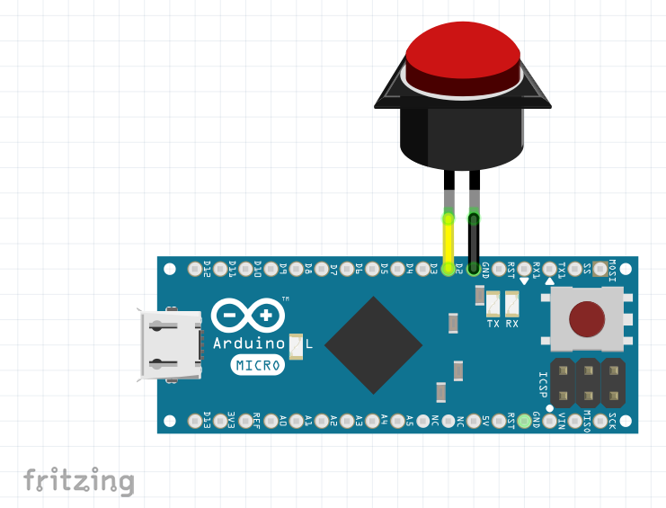
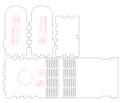

# OneButton
One Button Keyboard

### Schematic

### Arduino Code

[OneButton.ino](OneButton?raw=true)

    #include "Keyboard.h"
    
    // use this option for OSX.
    // Comment it out if using Windows or Linux:
    // char ctrlKey = KEY_LEFT_GUI;
    // use this option for Windows and Linux.
    // leave commented out if using OSX:
    char ctrlKey = KEY_LEFT_CTRL;
    
    void setup() {
      // make pin 2 an input and turn on the pull-up resistor so it goes high unless
      // connected to ground:
      pinMode(2, INPUT_PULLUP);
      // initialize control over the keyboard:
      Keyboard.begin();
    }
    
    void loop() {
      while (digitalRead(2) == HIGH) {
        // do nothing until pin 2 goes low
        delay(20);
      }
      
      //send crtl+a (azerty keyboard)
      Keyboard.press(ctrlKey);
      Keyboard.press('q'); //scancode de la touche a (azerty)
      delay(100);
      Keyboard.releaseAll();
    
      while (digitalRead(2) == LOW) {
        // do nothing until pin 2 goes low
        delay(20);
      }
    }
    
### Case

[OneButtonBox.svg](img/OneButtonBox.svg?raw=true)

    
